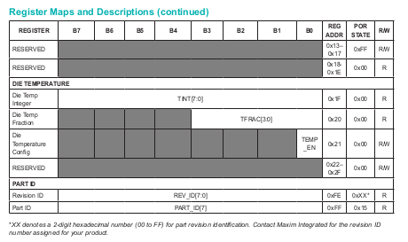
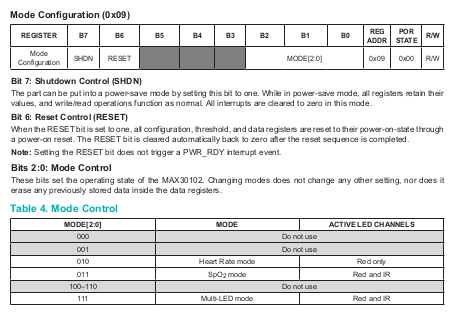

# Tutorial


This is an example of how a library for the MAX30102 Heart Rate and Pulse Oximetry sensor. We will do a partial walk through on how to implement the features and functionality as suggested in the [MAX30102 Datasheet](https://datasheets.maximintegrated.com/en/ds/MAX30102.pdf).

### Registers

The MAX30102 is controlled/adjusted using its eight bit registers. A register map detailed in the datasheet. Here is a snippet. 




We can see the register types, what each bit in the register does, the register address, its state when the device is powered on or reset (POR), and whether it is read only or writable. For example, 

###### Mode Configuration Register
* Writable
* All bits set to 0 on Power On or Reset
* Address at 0x09
* Bits
  * Most significant bit (MSB) B7 when set to 1, shuts down the sensor,
  * B6, when set to 1, resets the sensor,
  * B5, B4, B3 unused, default to 0,
  * Least Significant Bits (LSB) B2, B1 and B0 for choosing the operating mode.
  
The register map is implemented in ESP32 by defining the register addresses.

``` c
/**
 * MAX30102 internal registers definitions.
 */
#define MAX30102_DEVICE                   0x57
// Part ID
#define MAX30102_REV_ID                   0xFE
#define MAX30102_PART_ID                  0xFF
// Status
// - Interrupts
#define MAX30102_INT_STATUS               0x00
#define MAX30102_INT_STATUS_2             0x01  
#define MAX30102_INT_ENABLE               0x02
#define MAX30102_INT_ENABLE_2             0x03
// - FIFO  
#define MAX30102_FIFO_WRITE               0x04
#define MAX30102_FIFO_OVERFLOW_COUNTER    0x05
#define MAX30102_FIFO_READ                0x06
#define MAX30102_FIFO_DATA                0x07
// Configuration
#define MAX30102_FIFO_CONF                0x08  
#define MAX30102_MODE_CONF                0x09
#define MAX30102_SPO2_CONF                0x0A
#define MAX30102_LED_CONF                 0x0C  
#define MAX30102_LED_CONF_2               0x0D
#define MAX30102_MULTILED_REG             0x11
#define MAX30102_MULTILED_REG_2           0x12
// Die Temperature    
#define MAX30102_TEMP_INT                 0x1F
#define MAX30102_TEMP_FRACTION            0x20
#define MAX30102_TEMP_CONFIG              0x21  
```

We now define functions that read status of each register, and set the registers that are writable.
### Setting a Register
We will use the Mode Configuration as an example. The LSB bits B0, B1 and B2 select the mode, as given in the datasheet.



This control table is implemented as an enum.

``` c
/**
 * Operation Mode Enum.
 * Heart rate only or Oxygen saturation + Heart rate.
 */
typedef enum _max30102_mode_t {
    MAX30102_MODE_HR_ONLY                 = 0x02,
    MAX30102_MODE_SPO2                    = 0x03,
    MAX30102_MODE_SPO2_HR                 = 0x07  
} max30102_mode_t;

```

A function is then defined to set the Mode Configuration register.

``` c
esp_err_t max30102_set_mode(max30102_config_t* this, max30102_mode_t mode) {
    uint8_t current_mode_reg;
    //Tratar erros
    esp_err_t ret = max30102_read_register( this,
                                            MAX30102_MODE_CONF,
                                            &current_mode_reg );
    if(ret != ESP_OK) return ret;
    printf("Setting the mode...");
    printf("%x\n", (current_mode_reg & 0xF8) | mode );
    return max30102_write_register( this,
                                    MAX30102_MODE_CONF,
                                    (current_mode_reg & 0xF8) | mode );
}
```
The function reads the current state of the register, then writes the chosen mode only (all other bits masked by the AND 0xF8) to the register.

The MSB bits B6 and B7 of the register are set by the Initializing function.

### Reading a Register
We will use the FIFO register for reading. This register contains the sensor data measured from the photodiode.

[FIFO](images/max30102Fifo)

The FIFO register holds the data alternately between data read using the Red LED and the InfreRed LED, each taking 3 three bytes of data. So at each pass we read six bytes from the FIFO into a buffer, then split the data accordingly. 
``` c
esp_err_t max30102_read_fifo(max30102_config_t* this, max30102_fifo_t* fifo) {
    uint8_t buffer[6];
    //Testar erros
    esp_err_t ret = max30102_read_from(this, MAX30102_FIFO_DATA, buffer, 6);
    if(ret != ESP_OK) return ret;
    fifo->raw_red = ((uint32_t)buffer[0] << 16) | (buffer[1] << 8) | buffer[2];
    fifo->raw_ir = ((uint32_t)buffer[3] << 16) | (buffer[4] << 8) | buffer[5];

    return ESP_OK;
}

```


### Digital Signal Processing
Once the data is read, some digital signal processing steps are necessary to interpret the data. The DC component of the signal will need to be removed. The resulting signal is processed to detect the presences of peaks and troughs that form the heart beat. 

#### DC Removal

``` c
max30102_dc_filter_t max30102_dc_removal( float x,
                                          float prev_w,
                                          float alpha )
{
    max30102_dc_filter_t filtered = {};
    filtered.w = x + alpha * prev_w;
    filtered.result = filtered.w - prev_w;

    return filtered;
}

```
#### Butterworth Filter

``` c
void max30102_lpb_filter( max30102_config_t* this, float x )
{
    this->lpb_filter_ir.v[0] = this->lpb_filter_ir.v[1];

    //Fs = 100Hz and Fc = 10Hz
    this->lpb_filter_ir.v[1] = (2.452372752527856026e-1 * x) +
                               ( 0.50952544949442879485 * this->lpb_filter_ir.v[0] );
    
    //Fs = 100Hz and Fc = 4Hz
    /*this->lpb_filter_ir.v[1] = (1.367287359973195227e-1 * x)
                      + (0.72654252800536101020 * this->lpb_filter_ir.v[0]);
    //Very precise butterworth filter*/

    this->lpb_filter_ir.result = this->lpb_filter_ir.v[0] +
                                 this->lpb_filter_ir.v[1];
}
```
#### SpO2 

This is implemented in the ``` c max30102_update ``` function. The basic equations are discussed in detail in the .

[SpO2](images/max30102SpO2.png)

``` c
float ratio_rms = log( sqrt( this->red_ac_sq_sum /
                                     (float)this->samples_recorded ) ) /
                          log( sqrt( this->ir_ac_sq_sum /
                                     (float)this->samples_recorded ) );

        if(this->debug)
            printf("RMS Ratio: %f\n", ratio_rms);

        this->current_spO2 = 104.0 - 17.0 * ratio_rms;
        data->spO2 = this->current_spO2;
```


### Results

A typical output from the simple example is shown, indicating the Heart Rate and oxygen saturation (SpO2)
[Terminal](images/max30102Terminal.png)

### References

1. [MAX30102 Datasheet](https://datasheets.maximintegrated.com/en/ds/MAX30102.pdf)

2. [MAX30102 Application Node](https://pdfserv.maximintegrated.com/en/an/AN6409.pdf)
